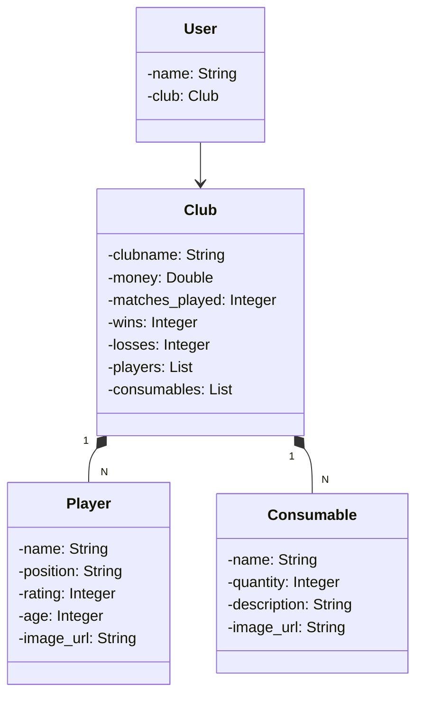

#My football club

```mermaid
classDiagram
  class User {
    -name: String
    -club: Club
  }

  class Club {
    -clubname: String
    -money: Double
    -matches_played: Integer
    -wins: Integer
    -losses: Integer
    -players: List<Player>
    -consumables: List<Consumable>
  }

  class Player {
    -name: String
    -position: String
    -rating: Integer
    -age: Integer
    -image_url: String
  }

  class Consumable {
    -name: String
    -quantity: Integer
    -description: String
    -image_url: String
  }

  User --> Club
  Club "1" *-- "N" Player
  Club "1" *-- "N" Consumable


```
